# CFX Equipment Message Usage and Flows

資料來源：

- `C:\Users\SExRD-CPG07\Downloads\CFX-V2.0-英文_25041701_LK.pdf`
- `https://www.connectedfactoryexchange.com/CFXDemo/sdk/html/R_Project_CFXSDK.htm`
- 本工作區整理出的 `cfx_messages/cfx_messages.json`

符號說明：

- `M`: 該設備類型必備能力。
- `MR`: 若設備配有 barcode/RFID reader 則必備。
- `O`: CFX 標準列為 optional，實作時依設備功能決定。

## 1. 所有機台共通必備訊息

所有 Endpoint Class 都至少需要支援下列共通能力。

| Capability | Topic | Required Messages | 用途 |
|---|---|---|---|
| Core Communications | `CFX` | `AreYouThereRequest`, `AreYouThereResponse`, `EndpointConnected`, `EndpointShuttingDown`, `GetEndpointInformationRequest`, `GetEndpointInformationResponse`, `WhoIsThereRequest`, `WhoIsThereResponse` | Endpoint 探測、上線、能力宣告、下線 |
| WIP Tracking | `CFX.Production` | `UnitsArrived`, `WorkStarted`, `WorkStageStarted`, `WorkStageCompleted`, `WorkStagePaused`, `WorkStageResumed`, `WorkCompleted`, `UnitsDeparted` | 工件進站、開工、站內 stage、完工、出站 |
| Basic Recipe Visibility | `CFX.Production` | `RecipeActivated`, `RecipeModified`, `GetActiveRecipeRequest`, `GetActiveRecipeResponse` | 回報目前 recipe，並回應查詢 |
| Station Performance Reporting | `CFX.ResourcePerformance` | `FaultOccurred`, `FaultAcknowledged`, `FaultCleared`, `HandleFaultRequest`, `HandleFaultResponse`, `GetActiveFaultsRequest`, `GetActiveFaultsResponse`, `LogEntryRecorded`, `StationOffline`, `StationOnline`, `StationStateChanged` | 機台狀態、故障、告警、log |

`WorkStagePaused` 和 `WorkStageResumed` 僅在機台支援製程中途 pause/resume 時必備，否則可視為 optional。

## 2. 共通流程

### 2.1 Endpoint 上線與能力宣告

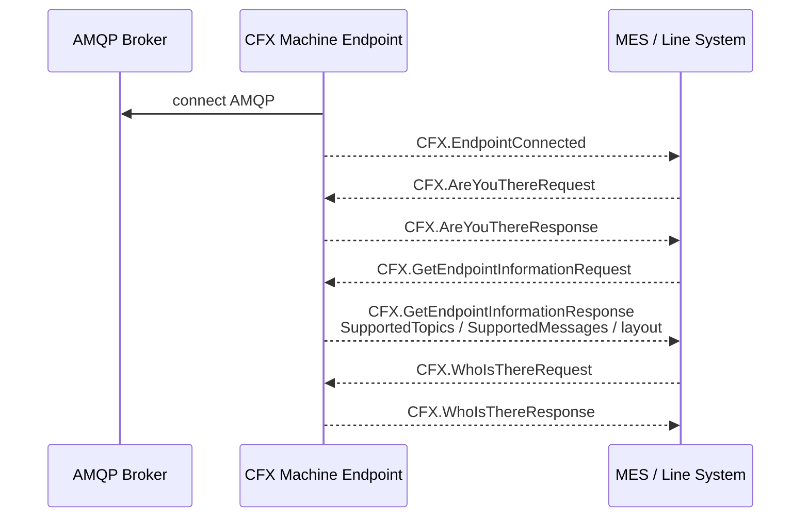

### 2.2 一般生產 WIP 流程

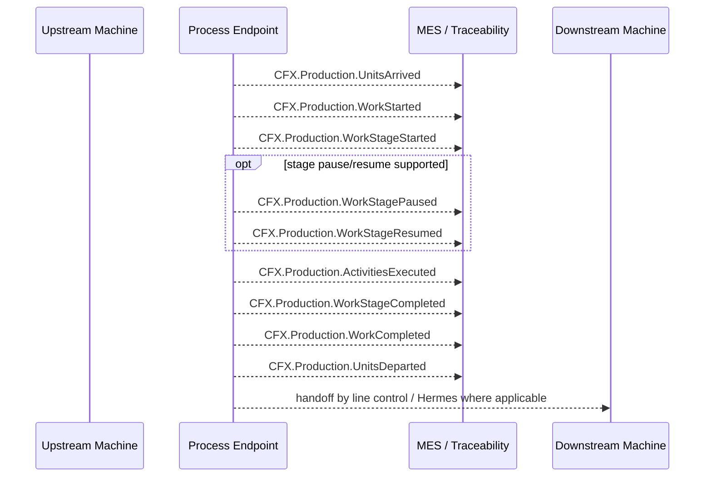

### 2.3 Recipe 查詢與遠端切換

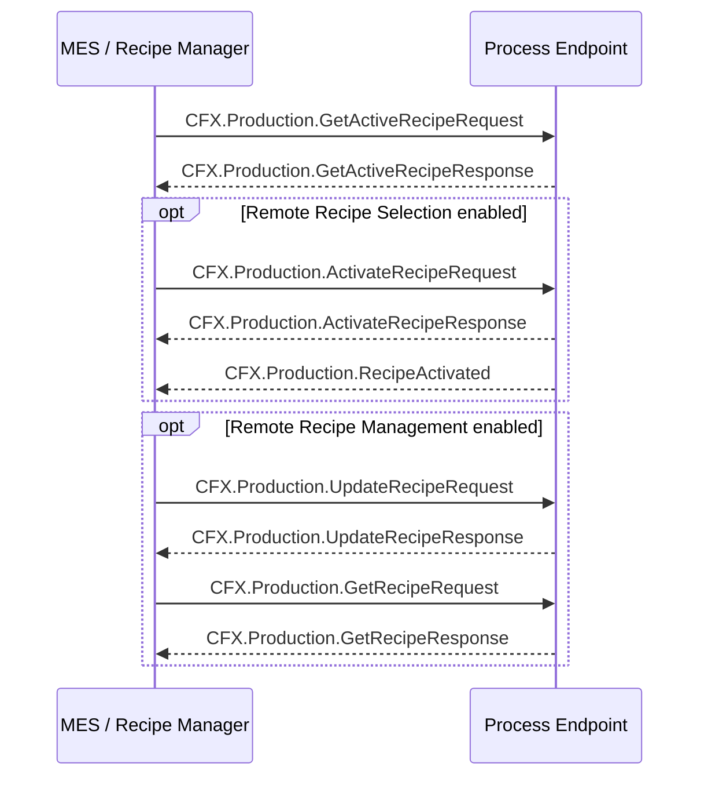

### 2.4 故障與狀態回報

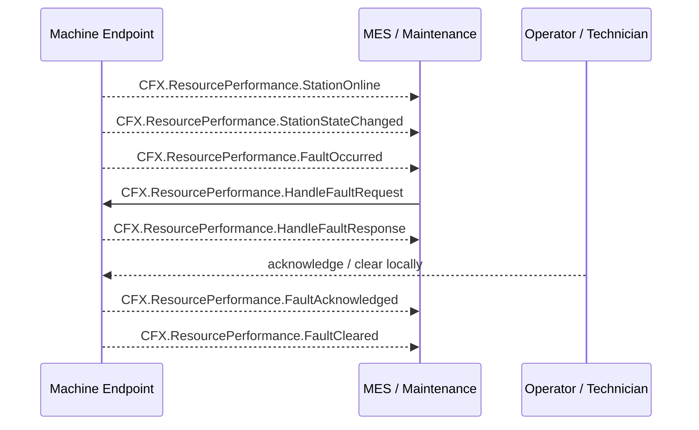

## 3. Capability 到 Message 對照

| Capability | Messages |
|---|---|
| WIP Identification | `WorkStarted` 或 `WorkCompleted`，其中 Unit Position 結構需明確識別 unit barcode/ID 或 carrier/panel ID |
| Unit Initialization | `UnitsInitialized` |
| Panelized Unit Initialization | `UnitsInitialized`，需包含 carrier/panel identifier 與所有 unit identifiers |
| Operator Tracking | `OperatorActivated`, `OperatorDeactivated` |
| Equipment Data Tracking | `ReadingsRecorded` |
| Unit Disqualification / Scrapping | `UnitsDisqualified` |
| Detailed Activity Tracking | `ActivitiesExecuted` |
| Material Trace with Internal Setup | `CFX.Production.Assembly.MaterialsInstalled`, `CFX.Production.Application.MaterialsApplied` |
| Exact Material Trace | `CFX.Production.Assembly.MaterialsInstalled`，需填 UnitPosition / ReferenceDesignator / MaterialPackage |
| Tool Trace | `ToolsUsed` |
| Process Route / Unit Status / Unit Trace Validation | `CFX.InformationSystem.UnitValidation.ValidateUnitsRequest`, `ValidateUnitsResponse` |
| Internal Setup Validation | `CFX.Materials.Storage.GetLoadedMaterialsRequest`, `GetLoadedMaterialsResponse`, `MaterialsLoaded`, `MaterialsUnloaded`, `ValidateStationSetupRequest`, `ValidateStationSetupResponse` |
| Offline Setup | `CFX.Materials.Storage.MaterialCarriersLoaded`, `MaterialCarriersUnloaded` |
| External Setup Validation | `GetRequiredSetupRequest`, `GetRequiredSetupResponse`, `SetupRequirementsChanged`, `LockStationRequest`, `LockStationResponse`, `UnlockStationRequest`, `UnlockStationResponse` |
| Material Blocking for External Setup | `BlockMaterialLocationsRequest`, `BlockMaterialLocationsResponse`, `UnblockMaterialLocationsRequest`, `UnblockMaterialLocationsResponse` |
| Material Blocking for Internal Setup | `BlockMaterialsRequest`, `BlockMaterialsResponse`, `UnblockMaterialsRequest`, `UnblockMaterialsResponse` |
| Station Locking | `LockStationRequest`, `LockStationResponse`, `UnlockStationRequest`, `UnlockStationResponse` |
| Unit Personalization | `CFX.Production.Assembly.UnitsPersonalized` |
| Advanced Station Performance | `CalibrationPerformed`, `StageStateChanged`, `ToolChanged` |
| Station Configuration Management | `StationParametersModified`, `ModifyStationParametersRequest`, `ModifyStationParametersResponse` |
| Station Maintenance Tracking | `MaintenancePerformed` |
| Energy Consumption Tracking | `EnergyConsumed` |
| Production Unit Inspection | `CFX.Production.TestAndInspection.UnitsInspected` |
| Production Unit Test | `CFX.Production.TestAndInspection.UnitsTested` |
| Solder Paste / Reflow / Coating / Cleaning / Labeling / Wave / Hand Soldering Processing | `CFX.Production.Processing.UnitsProcessed` with process-specific dynamic structure |
| Solder Paste Printing | `CFX.ResourcePerformance.SolderPastePrinting.StencilCleaned` |

## 4. 每種機台的必備訊息

下表只列 PDF Table 6-1 中的 `M` 與 `MR`。所有機台都另外繼承第 1 節的共通必備訊息。

| Endpoint Class | 必備能力與訊息 | 條件式 MR |
|---|---|---|
| Generic Equipment Endpoint | 共通必備 | `WIP Identification`; 若有 reader，使用 `WorkStarted` 或 `WorkCompleted` 識別 unit。`Tool Trace` 若有 reader，使用 `ToolsUsed`。 |
| Automated Labeler / Laser Marker | 共通必備; `WIP Identification`; `Unit Initialization`; `Panelized Unit Initialization`; `Labeling` 使用 `UnitsProcessed` + `LaserMarkingProcessData` | 無 |
| Stencil Printer | 共通必備; `Solder Paste Printing` 使用 `StencilCleaned` | `WIP Identification`; `Tool Trace` |
| Solder Paste Inspection (SPI) | 共通必備; `Production Unit Inspection` 使用 `UnitsInspected`; `Solder Paste Inspection` 使用 `UnitsInspected` + `SolderPasteMeasurement` | `WIP Identification` |
| SMT Mounter / Pick and Place | 共通必備; `Exact Material Trace with External Setup` 使用 `MaterialsInstalled` | `WIP Identification`; `Exact Material Trace with Internal Setup`; 視 reader 能力做材料/位置精確追溯 |
| Automated Optical Inspection (AOI/AXI) | 共通必備; `Production Unit Inspection` 使用 `UnitsInspected`; `Automated Optical Inspection` 使用 `UnitsInspected` 並填 ReferenceDesignator / UnitPosition / PartNumber | `WIP Identification` |
| Solder Reflow Oven | 共通必備; `Solder Paste Reflow Processing` 使用 `UnitsProcessed` + `ReflowProcessData` | `WIP Identification` |
| Reflow Profiling | 共通必備; `Solder Paste Reflow Profiling` 使用 `UnitsProcessed` + `ReflowProfilingProcessData` | `WIP Identification` |
| Selective Solder | 共通必備; `Selective Solder Processing` 使用 `UnitsProcessed` + `SelectiveSolderProcessData` | `WIP Identification` |
| Through-Hole Component Insertion (THT) | 共通必備; `Exact Material Trace with External Setup` 使用 `MaterialsInstalled` | `WIP Identification`; `Exact Material Trace with Internal Setup` |
| Test Equipment | 共通必備; `Production Unit Test` 使用 `UnitsTested` | `WIP Identification` |
| Conformal Coating | 共通必備; `Conformal Coating` 使用 `UnitsProcessed` + `CoatingProcessData` | `WIP Identification` |
| Cleaning | 共通必備; `Cleaning` 使用 `UnitsProcessed` + `CleaningProcessData` | `WIP Identification` |
| Hand Soldering | 共通必備; `Hand Soldering Processing` 使用 `UnitsProcessed` + `HandSolderingProcessData` | `WIP Identification` |
| Wave Soldering | 共通必備; `Wave Soldering` 使用 `UnitsProcessed` + `WaveProcessData` | `WIP Identification` |

## 5. 依機台類型的典型流程

### 5.1 Stencil Printer

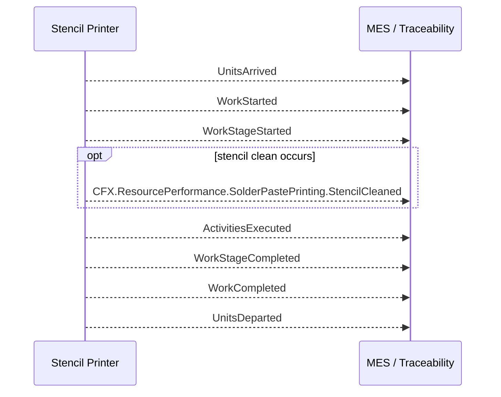

### 5.2 SPI

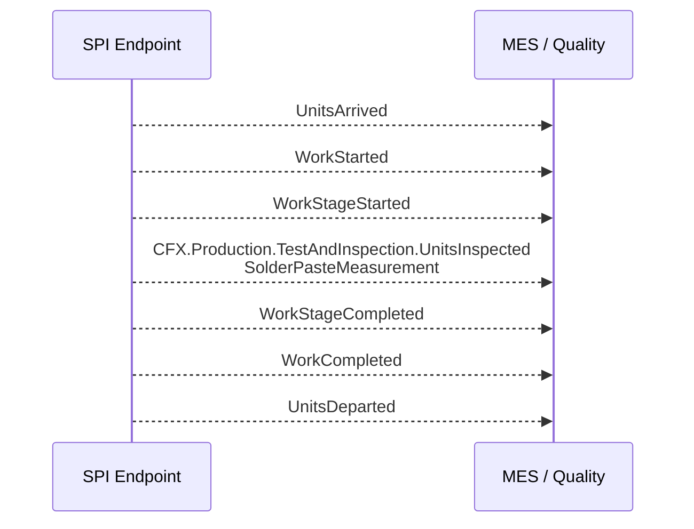

### 5.3 SMT Mounter

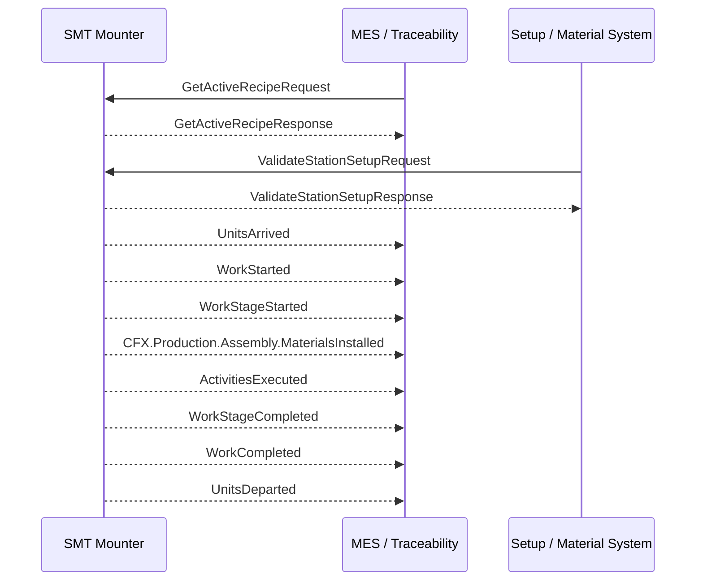

### 5.4 AOI / AXI

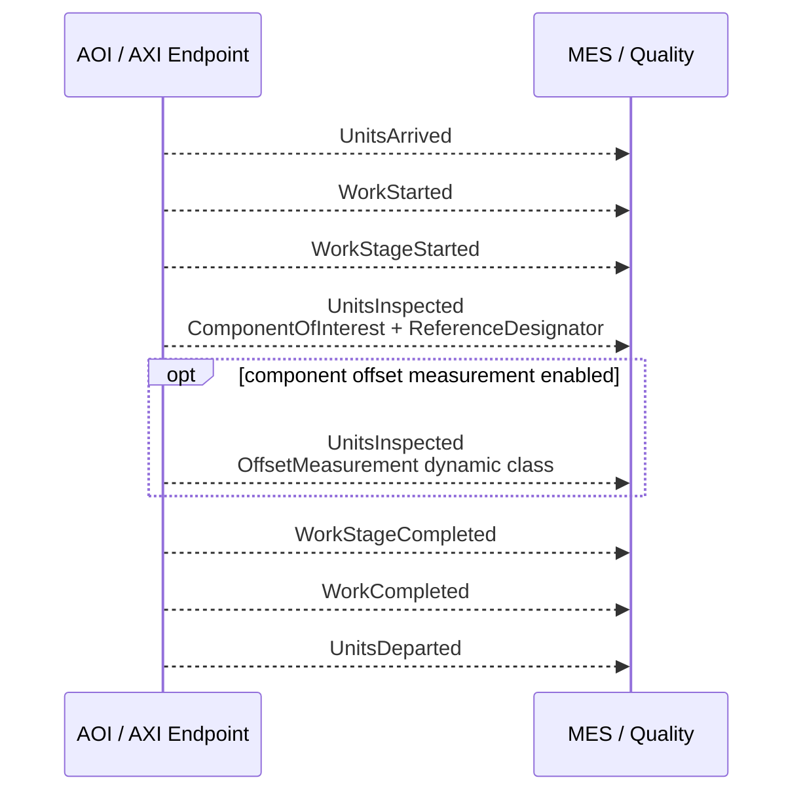

### 5.5 Reflow Oven / Reflow Profiling

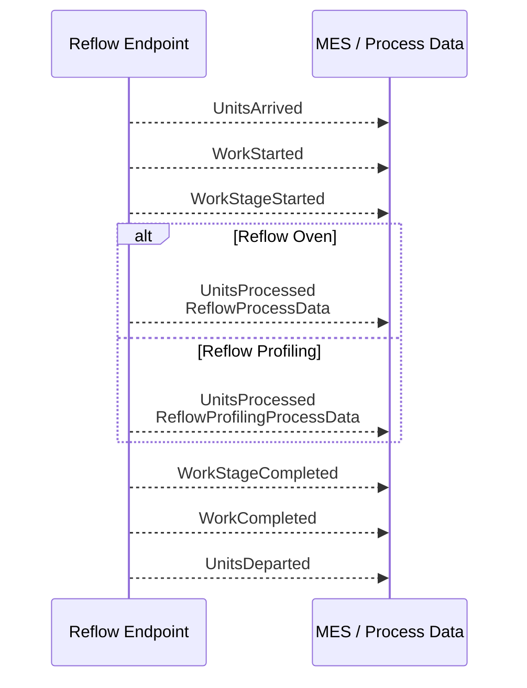

### 5.6 Selective Solder / Wave Solder / Hand Solder

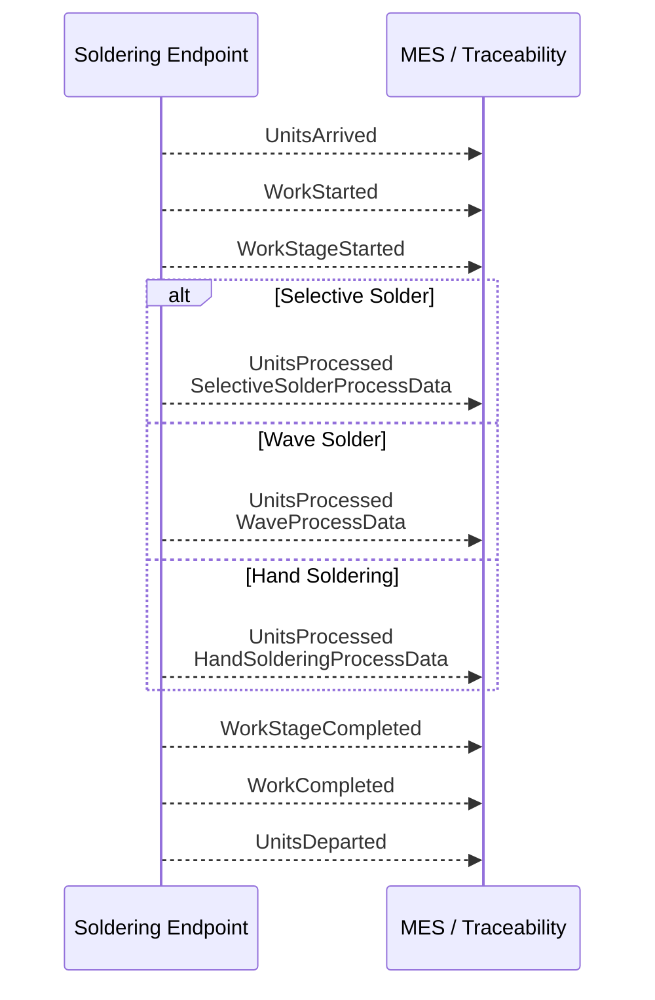

### 5.7 Test Equipment

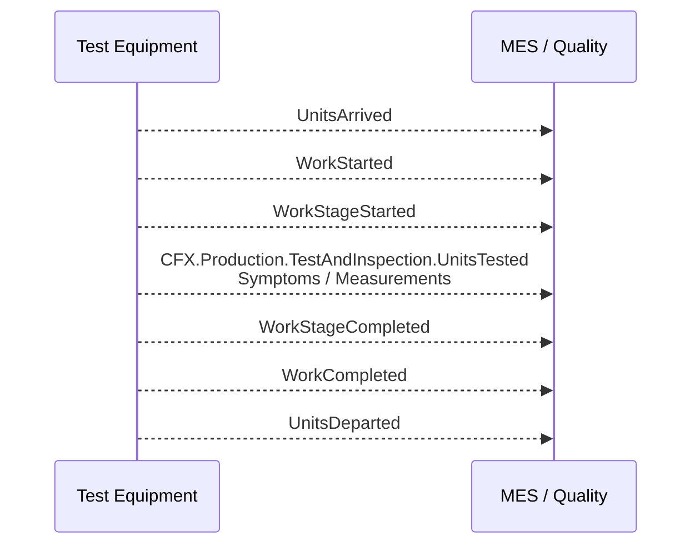

### 5.8 Labeler / Laser Marker

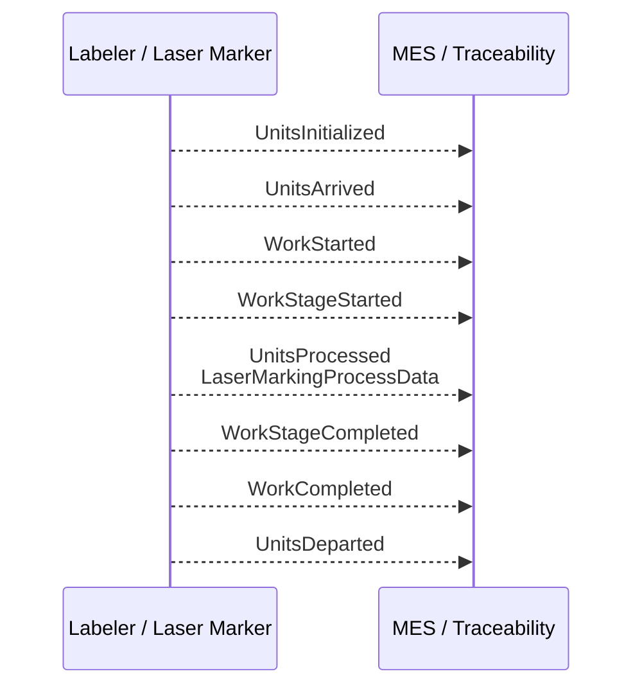

### 5.9 Conformal Coating / Cleaning

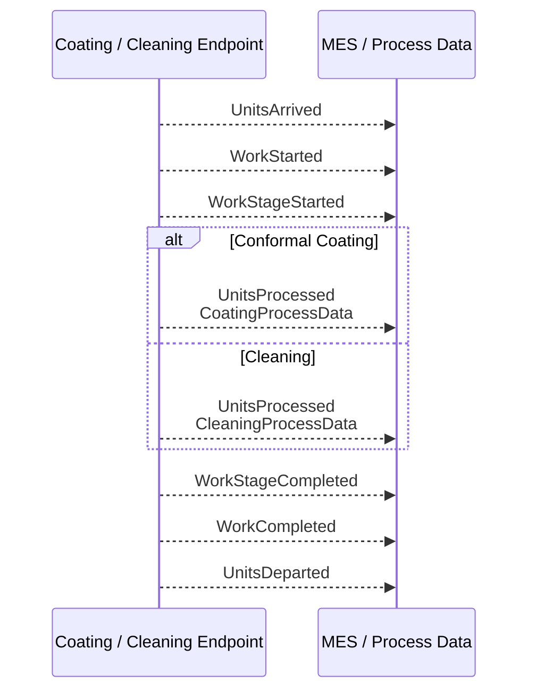

## 6. 導入建議

1. 先實作所有機台共通的 `CFX` root messages、WIP tracking、recipe visibility、station performance。
2. 再依設備是否有 scanner 決定 `WIP Identification` 是否進入必備。
3. 依機台類型加入特殊製程訊息，例如 SPI/AOI 用 `UnitsInspected`，Test 用 `UnitsTested`，Reflow/Coating/Cleaning/Labeling/Soldering 用 `UnitsProcessed` 搭配 dynamic structure。
4. 若要做 MES interlock，再加上 `ValidateUnitsRequest/Response`、setup validation、station locking。
5. 若要完整 traceability，SMT Mounter 與 THT 應優先補 `MaterialsInstalled` 的 exact material trace。
