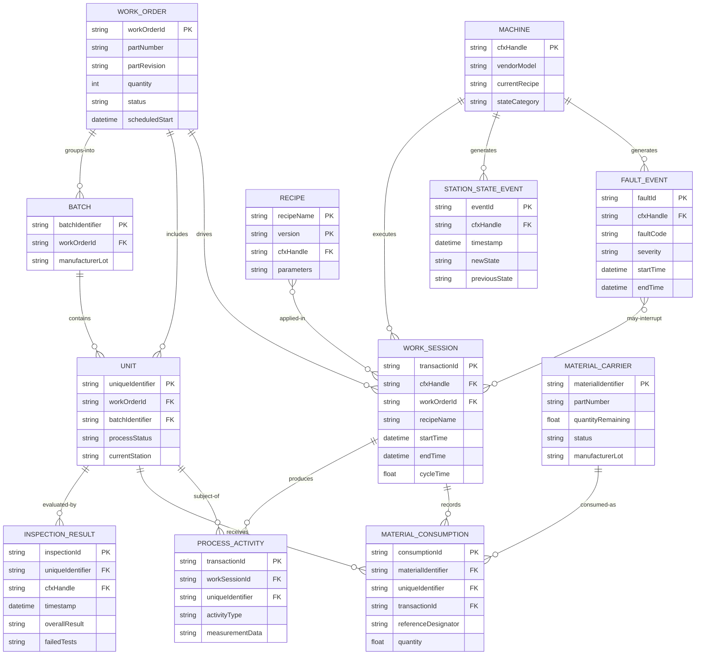
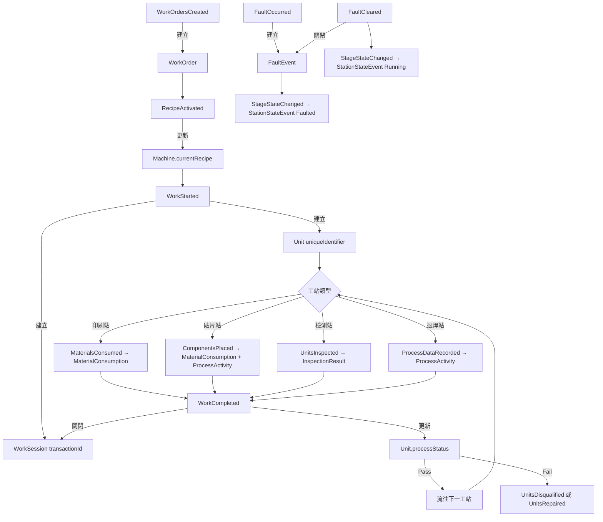

# CFX 2.0 Domain Model Design

**Date:** 2026-05-07  
**Status:** Approved  
**Scope:** 在 CFX Reference 工具中新增 `data/domain-model.json`，定義 12 個核心 Domain Entity 及其資料關係，供開發者理解 CFX 訊息如何建立資料串聯。不修改現有 UI。

---

## 問題陳述

現有 CFX Reference 工具已有 `messages.json`、`flows.json`、`machines.json`、`scenarios.json`，但缺少「訊息如何轉換成資料實體」的模型說明。開發者在閱讀 flows 後，難以理解 WorkOrder、Unit、WorkSession 等核心業務物件如何從 CFX 訊息中建立、更新與串聯。

## 設計目標

1. 建立 `data/domain-model.json`，定義 12 個核心 Domain Entity 與 15 條資料關係
2. 不修改任何現有 HTML/CSS/JS/UI
3. 僅新增 JSON 資料檔，可由未來 UI 模組讀取展示
4. 依 MVP Phase 分階段標記實作優先順序

---

## 核心 Domain Entities（12 個）

### 1. WorkOrder（工單）
- **主鍵：** `workOrderId`
- **用途：** 所有生產活動的根錨點，定義料號、數量、排程
- **建立：** `CFX.InformationSystem.WorkOrderManagement.WorkOrdersCreated`
- **更新：** `WorkOrderStatusUpdated`, `WorkOrderQuantityUpdated`, `WorkOrdersUpdated`
- **刪除：** `WorkOrdersDeleted`

### 2. Batch（批次）
- **主鍵：** `batchIdentifier`
- **用途：** 物料批號群組，支援追溯性分析
- **來源：** `WorkStarted.Units[].BatchIdentifier`（隱含建立，無專屬 Create 訊息）

### 3. Unit（在製品）
- **主鍵：** `uniqueIdentifier`
- **用途：** 產線上流動的最小 WIP 單元（PCB/拼板）
- **建立：** `CFX.Production.WorkStarted.Units[]`
- **更新：** `WorkCompleted`, `UnitsInspected`, `MaterialsInstalled`, `ComponentsPlaced`
- **結束：** `UnitsDisqualified`

### 4. Machine（機台）
- **主鍵：** `cfxHandle`（格式：`{Vendor}.{Model}.{SerialNo}`）
- **用途：** CFX 網路節點，所有事件的發布來源
- **建立：** `CFX.EndpointConnected`
- **更新：** `Heartbeat`, `StageStateChanged`, `RecipeActivated`
- **下線：** `CFX.ResourcePerformance.StationOffline`

### 5. WorkSession（工作階段）
- **主鍵：** `transactionId`（UUID）
- **用途：** Machine + WorkOrder + Unit 的時間容器，OEE / CycleTime 計算基礎
- **建立：** `CFX.Production.WorkStarted`（含 `CFXHandle`, `WorkOrderId`, `RecipeName`, `Units[]`）
- **關閉：** `CFX.Production.WorkCompleted`（同 `TransactionId`）
- **異常：** FaultOccurred 後無 WorkCompleted → WorkSession 保持 Open，由 MES 超時處理

### 6. ProcessActivity（製程活動）
- **主鍵：** `transactionId`（各製程訊息提供）
- **用途：** 具體製程動作與量測數據記錄（不可變事件）
- **來源：** `ComponentsPlaced`, `PCBSelectiveSoldered`, `ComponentsPressed`, `ComponentsInserted`, `ProcessDataRecorded`

### 7. InspectionResult（檢測結果）
- **主鍵：** 複合 `(uniqueIdentifier, cfxHandle, timestamp)`
- **用途：** 每個 Unit 在每個檢測站的 Pass/Fail 記錄
- **建立：** `CFX.Production.TestAndInspection.UnitsInspected`
- **更新：** `WorkOrderActionExecuted`（人工判定覆蓋）

### 8. MaterialCarrier（物料載體）
- **主鍵：** `materialIdentifier`
- **用途：** 料卷/托盤實體，追蹤從入庫到退料的完整生命週期
- **建立：** `MaterialsInitialized`
- **更新：** `MaterialsConsumed`, `MaterialsLoaded/Unloaded`
- **結束：** `MaterialsRetired`, `MaterialsEmpty`

### 9. MaterialConsumption（物料消耗記錄）
- **主鍵：** 複合 `(materialIdentifier, transactionId, timestamp)`
- **用途：** Unit ↔ MaterialCarrier 的消耗關聯，支援物料追溯
- **來源：** `MaterialsConsumed`, `MaterialsInstalled`, `ComponentsPlaced.InstalledMaterials[]`

### 10. Recipe（配方）
- **主鍵：** 複合 `(recipeName, version)`
- **用途：** 機台加工參數的版本化定義，與 WorkSession 關聯確保可追溯
- **建立：** `RecipeActivated`
- **更新：** `RecipeModified`, `LocalRecipeChanged`
- **移除：** `RecipeDeactivated`

### 11. StationStateEvent（站點狀態事件）
- **主鍵：** 複合 `(cfxHandle, timestamp)`
- **用途：** 機台狀態切換歷程（Running/Idle/Blocked/Faulted），OEE 可用率計算基礎
- **來源：** `StageStateChanged`, `SleepStateChanged`

### 12. FaultEvent（故障事件）
- **主鍵：** 複合 `(cfxHandle, faultCode, startTime)`
- **用途：** 機台異常的完整記錄（MTBF/MTTR 分析）
- **建立：** `FaultOccurred`
- **關閉：** `FaultCleared`

---

## 資料串聯規則

### WorkOrder → Batch / Unit
```
WorkOrdersCreated → WorkOrder { workOrderId }
WorkStarted.WorkOrderId → WorkSession.workOrderId (FK)
WorkStarted.Units[].UniqueIdentifier → Unit.uniqueIdentifier
WorkStarted.Units[].BatchIdentifier → Batch.batchIdentifier
```

### WorkSession 生命週期
| 事件 | 動作 |
|---|---|
| `WorkStarted` | 建立 WorkSession，記錄 cfxHandle, workOrderId, recipeName, startTime, unitIds[] |
| `WorkCompleted`（同 TransactionId） | 關閉 WorkSession，記錄 endTime, result, cycleTime |
| `StationOffline` | 觸發所有 Open WorkSession 異常關閉 |
| 超時 | MES 標記異常關閉（CFX 標準無定義，由 MES 實作） |

### Material → Unit
```
ComponentsPlaced / MaterialsInstalled
  → MaterialConsumption { unitId, materialIdentifier, referenceDesignator, transactionId }

追溯路徑: Unit → MaterialConsumption → MaterialCarrier → PartNumber / ManufacturerLot
```

### InspectionResult → Unit
```
UnitsInspected.Units[{ UniqueIdentifier, OverallResult, FailedTests[] }]
  → InspectionResult { unitId, stationId, timestamp, overallResult, failedTests[] }

一個 Unit 可有多筆 InspectionResult（每個 SPI/AOI/ICT 站各一筆）
```

### Recipe → WorkSession
```
RecipeActivated → Machine.currentRecipe = { name, version }
WorkStarted.RecipeName → WorkSession.recipeName
串聯: WorkSession.recipeName + version → Recipe { name, version, parameters }
```

### StationState / Fault → Machine
```
StageStateChanged.CFXHandle → StationStateEvent.cfxHandle (FK → Machine)
FaultOccurred.CFXHandle → FaultEvent.cfxHandle (FK → Machine)
FaultCleared → FaultEvent.endTime = now, duration = endTime - startTime

時間重疊分析:
  FaultEvent.{startTime, endTime} ∩ WorkSession.{startTime, endTime}
  → 計算故障導致的生產中斷時間（OEE 可用率扣減）
```

---

## ER Diagram



---

## WIP 資料關係建立流程



---

## data/domain-model.json 結構規格

### 頂層結構

```json
{
  "version": "1.0.0",
  "description": "CFX 2.0 Domain Entity & Relationship Model",
  "mvpPhases": { ... },
  "entities": [ EntityDefinition ],
  "relationships": [ RelationshipDefinition ]
}
```

### EntityDefinition Schema

```jsonc
{
  "id": "WorkOrder",           // 唯一識別，PascalCase
  "labelZh": "工單",           // 中文顯示名稱
  "mvpPhase": 1,               // 1-4，實作優先順序
  "pk": ["workOrderId"],       // 主鍵欄位陣列（複合鍵為多元素）
  "fk": [                      // 外鍵關係
    { "field": "...", "ref": "Entity.field" }
  ],
  "attributes": [
    {
      "name": "workOrderId",
      "type": "string",        // string | integer | float | datetime | uuid | enum | boolean
      "required": true,
      "values": [],            // 僅 enum 使用
      "desc": "工單唯一識別碼"
    }
  ],
  "createdBy": ["CFX.InformationSystem.WorkOrderManagement.WorkOrdersCreated"],
  "updatedBy": ["CFX.InformationSystem.WorkOrderManagement.WorkOrderStatusUpdated"],
  "deletedBy": ["CFX.InformationSystem.WorkOrderManagement.WorkOrdersDeleted"],
  "notes": ""
}
```

### RelationshipDefinition Schema

```jsonc
{
  "from": "WorkOrder",
  "to": "Unit",
  "cardinality": "1:N",        // 1:1 | 1:N | N:M
  "via": "WorkStarted.WorkOrderId",  // 串聯機制說明
  "mvpPhase": 1
}
```

---

## MVP 分階段實作計畫

### Phase 1 — 基本 WIP 追蹤（6 Entities）

**目標：** 能追蹤「哪台機台、在哪個工單、處理了哪些板卡、結果如何」

| Entity | 原因 |
|---|---|
| Machine | 所有事件的來源，必須最先建立 |
| WorkOrder | 驅動所有生產活動的根節點 |
| Unit | WIP 的最小追蹤單元 |
| WorkSession | 連結 Machine + WorkOrder + Unit + 時間 |
| InspectionResult | 品質判定，直接影響良率分析 |
| FaultEvent | 最低限度的異常追蹤 |

**Relationships（Phase 1）：**
- Machine `1:N` WorkSession（via WorkStarted.CFXHandle）
- WorkOrder `1:N` WorkSession（via WorkStarted.WorkOrderId）
- WorkSession `N:M` Unit（via WorkStarted.Units[]）
- Unit `1:N` InspectionResult（via UnitsInspected.Units[]）
- Machine `1:N` FaultEvent（via FaultOccurred.CFXHandle）

### Phase 2 — 物料追溯（+3 Entities）

| Entity | 說明 |
|---|---|
| MaterialCarrier | 料卷/托盤實體 |
| MaterialConsumption | 消耗記錄（Unit ↔ Carrier） |
| Batch | 批次追溯（Unit ↔ 物料批號） |

> `Batch` 在 Phase 1 可作為 `Unit.batchIdentifier` 屬性，Phase 2 升格為獨立 Entity。

### Phase 3 — OEE 計算（+2 Entities）

| Entity | 說明 |
|---|---|
| StationStateEvent | Running/Idle/Blocked 歷程 → OEE 可用率 |
| ProcessActivity | 製程量測資料 → OEE 效率率 |

### Phase 4 — 配方管理（+1 Entity）

| Entity | 說明 |
|---|---|
| Recipe | 配方版本管理，WorkSession 的配方快照記錄 |

> `Recipe` 在 Phase 1-3 可作為 `WorkSession.recipeName` 字串儲存，Phase 4 展開為含版本歷程的完整 Entity。

---

## 實作約束

1. **不修改任何現有 HTML / CSS / JS / UI 元素**
2. **僅新增 `data/domain-model.json`**
3. **JSON 結構需能通過 `JSON.parse()` 驗證**
4. **所有 `createdBy` / `updatedBy` 引用的訊息名稱必須存在於 `data/messages.json`**
5. **所有 `via` 欄位引用的 flow 必須存在於 `data/flows.json`（或說明為 CFX 標準隱含行為）**

---

## 成功標準

- [ ] `data/domain-model.json` 存在且格式正確
- [ ] 包含所有 12 個 Entity 定義（Phase 1-4 標記）
- [ ] 包含所有 15 條 Relationship 定義
- [ ] 所有引用的 CFX Message 名稱均存在於 `messages.json`
- [ ] `JSON.parse()` 驗證通過
- [ ] 通過資料品質驗證腳本（引用訊息存在性檢查）
